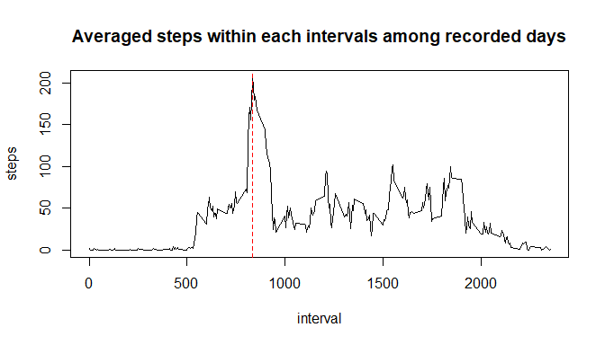
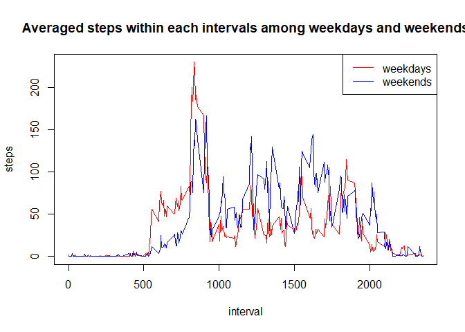

## Loading and preprocessing the data

```r
library(readr)
AM_data <- read.csv2(unz("activity.zip", "activity.csv"), header = TRUE, sep = ",")
AM_data$date <- as.POSIXct(AM_data$date, format = "%Y-%m-%d")
```

## What is mean total number of steps taken per day?

```r
par(mar = c(5, 4, 1, 1))
dates <- unique(AM_data$date)
AM_data_sortbydate <- as.data.frame(matrix(data = NA, length(dates),2))
colnames(AM_data_sortbydate) <- c("date", "steps")
AM_data_sortbydate$date <- dates
for (d in 1:length(AM_data_sortbydate$date)){
  steps <- AM_data[AM_data$date == AM_data_sortbydate$date[d],][,1]
  AM_data_sortbydate$steps[d] <- sum(steps)
}
library(ggplot2)
steps_median <- median(AM_data_sortbydate$steps, na.rm = TRUE)
steps_mean <- mean(AM_data_sortbydate$steps, na.rm = TRUE)
```
The mean and median of total number of steps taken per day are `steps_mean` and `steps_median` respectively.

## What is the average daily activity pattern?

```r
intervals <- AM_data$interval[AM_data$date == AM_data$date[1]]
AM_data_sortbyinterval <- as.data.frame(matrix(NA, length(intervals), 2))
colnames(AM_data_sortbyinterval) <- c("steps", "interval")
AM_data_sortbyinterval$interval <- intervals
for (i in 1:length(intervals)){
  steps_sum_interval <- AM_data$steps[AM_data$interval == intervals[i]]
  AM_data_sortbyinterval$steps[i] <- mean(steps_sum_interval, na.rm = TRUE)
}
plot(AM_data_sortbyinterval$interval, AM_data_sortbyinterval$steps, xlab = "interval", ylab = "steps", main = "Averaged steps within each intervals among recorded days", type = "l")
max_timepoint <- AM_data_sortbyinterval$interval[AM_data_sortbyinterval$steps == max(AM_data_sortbyinterval$steps, na.rm = TRUE)]
abline(v = max_timepoint, col = "red", lty = 2)
```

<!-- -->
The 835 interval, on average across all days in the dataset, contains the maximum number of steps.

## Imputing missing values

```r
NA_num <- sum(!complete.cases(AM_data$steps))
AM_data_NAsfilled <- AM_data
for (i in 1:nrow(AM_data_NAsfilled)){
  if (!complete.cases(AM_data_NAsfilled$steps[i])){
    AM_data_NAsfilled$steps[i] <- AM_data_sortbyinterval$steps[AM_data_sortbyinterval$interval == AM_data_NAsfilled$interval[i]]
  }
}
dates <- unique(AM_data_NAsfilled$date)
AM_data_NAsfilled_sortbydate <- as.data.frame(matrix(data = NA, length(dates),2))
colnames(AM_data_NAsfilled_sortbydate) <- c("date", "steps")
AM_data_NAsfilled_sortbydate$date <- dates
for (d in 1:length(AM_data_NAsfilled_sortbydate$date)){
  steps <- AM_data_NAsfilled[AM_data_NAsfilled$date == AM_data_NAsfilled_sortbydate$date[d],][,1]
  AM_data_NAsfilled_sortbydate$steps[d] <- sum(steps)
}
steps_median_ <- median(AM_data_NAsfilled_sortbydate$steps, na.rm = TRUE)
steps_mean_ <- mean(AM_data_NAsfilled_sortbydate$steps, na.rm = TRUE)
```
There are `NA_num` total number of missing values in the dataset.
The mean and median of total number of steps taken per day, after the missing value imputation, are `steps_mean_` and `steps_median_` respectively.
## Are there differences in activity patterns between weekdays and weekends?

```r
wk <- function(date){
  ## return the logical vector, where loci of weekdays are TRUE, loci of weekends are FALSE
  rt <- logical(length(date))
  rt <- (weekdays(date, abbreviate = TRUE) == "Sat") | (weekdays(date, abbreviate = TRUE) == "Sun")
  rt <- !rt
  return(rt)
}
wks <- character(length(AM_data_NAsfilled))
wks[wk(AM_data_NAsfilled$date)] <- "weekday"
wks[!wk(AM_data_NAsfilled$date)] <- "weekend"
wks <- as.factor(wks)
AM_data_NAsfilled$weekday <- wks
intervals <- AM_data_NAsfilled$interval[AM_data_NAsfilled$date == AM_data_NAsfilled$date[1]]
AM_data_NAsfilled_sortbyinterval_wday <- as.data.frame(matrix(NA, length(intervals), 2))
AM_data_NAsfilled_sortbyinterval_wend <- as.data.frame(matrix(NA, length(intervals), 2))
colnames(AM_data_NAsfilled_sortbyinterval_wday) <- c("steps", "interval")
colnames(AM_data_NAsfilled_sortbyinterval_wend) <- c("steps", "interval")
AM_data_NAsfilled_sortbyinterval_wday$interval <- intervals
AM_data_NAsfilled_sortbyinterval_wend$interval <- intervals
for (i in 1:length(intervals)){
  steps_sum_interval_wday <- AM_data_NAsfilled$steps[(AM_data_NAsfilled$interval == intervals[i]) & (AM_data_NAsfilled$weekday == "weekday")]
  AM_data_NAsfilled_sortbyinterval_wday$steps[i] <- mean(steps_sum_interval_wday)
}
for (i in 1:length(intervals)){
  steps_sum_interval_wend <- AM_data_NAsfilled$steps[(AM_data_NAsfilled$interval == intervals[i]) & (AM_data_NAsfilled$weekday == "weekend")]
  AM_data_NAsfilled_sortbyinterval_wend$steps[i] <- mean(steps_sum_interval_wend)
}
plot(AM_data_NAsfilled_sortbyinterval_wday$interval, AM_data_NAsfilled_sortbyinterval_wday$steps, xlab = "interval", ylab = "steps", main = "Averaged steps within each intervals among weekdays and weekends", col = "red", type = "l")
points(AM_data_NAsfilled_sortbyinterval_wend$interval, AM_data_NAsfilled_sortbyinterval_wend$steps, col = "blue", type = "l")
legend("topright", lty = 1, col = c("red", "blue"), legend = c("weekdays", "weekends"))
```

<!-- -->
